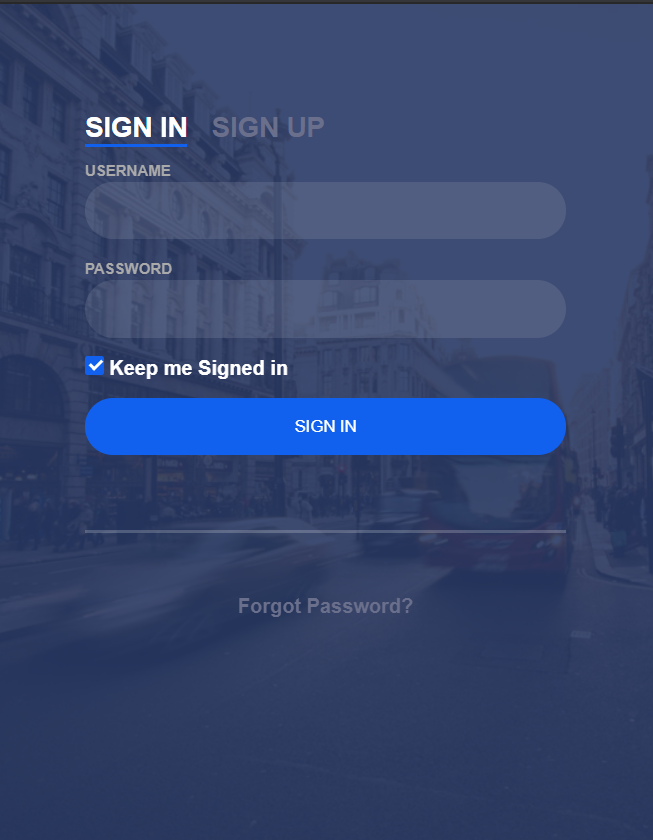
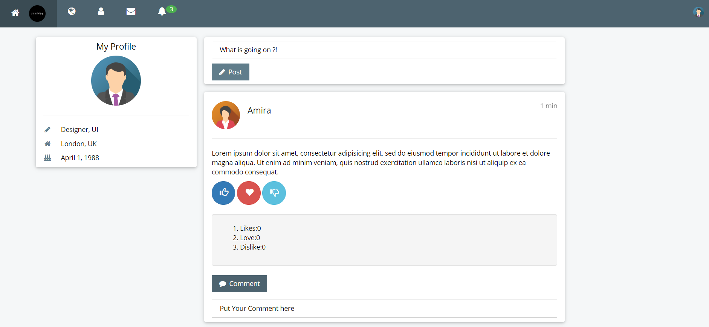
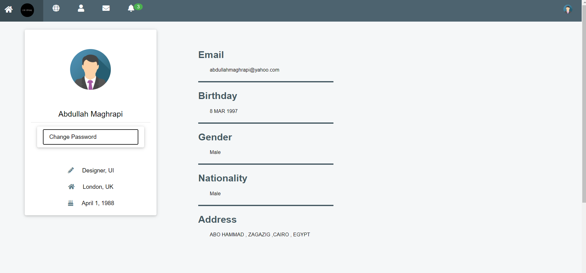
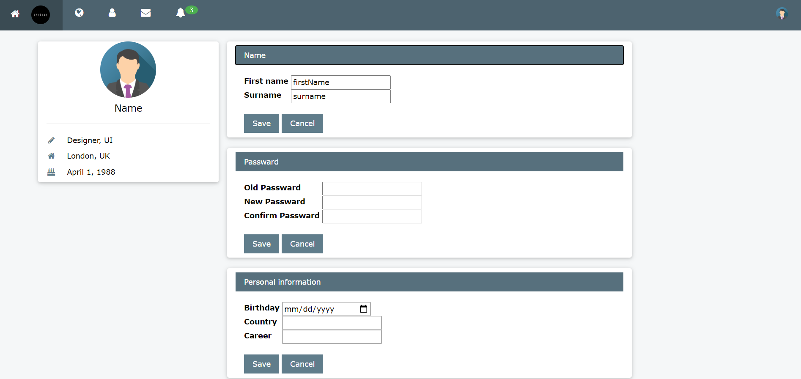
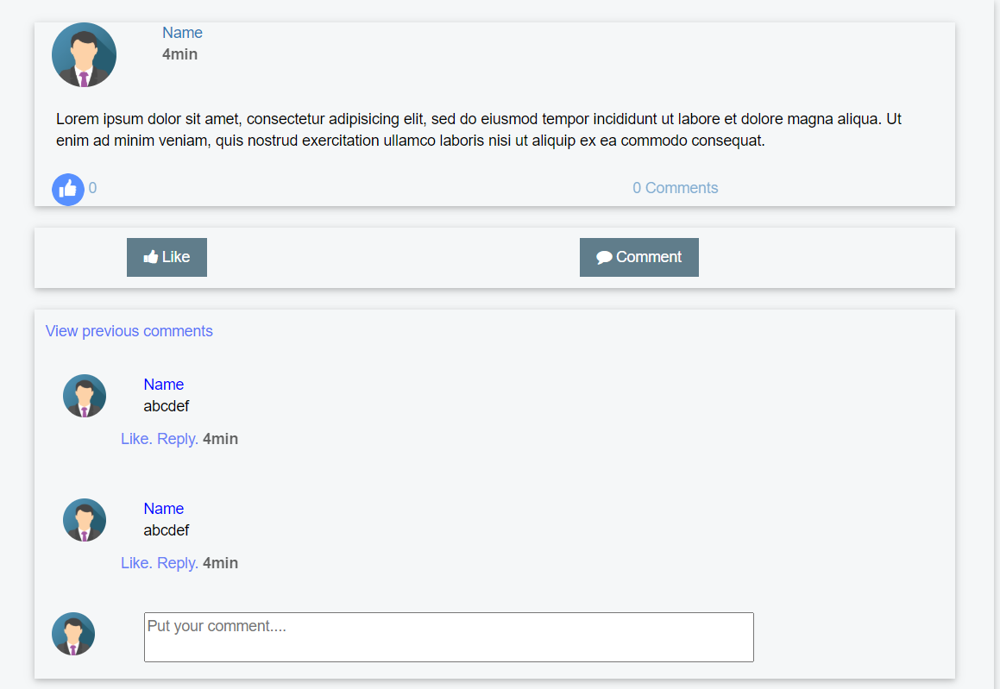
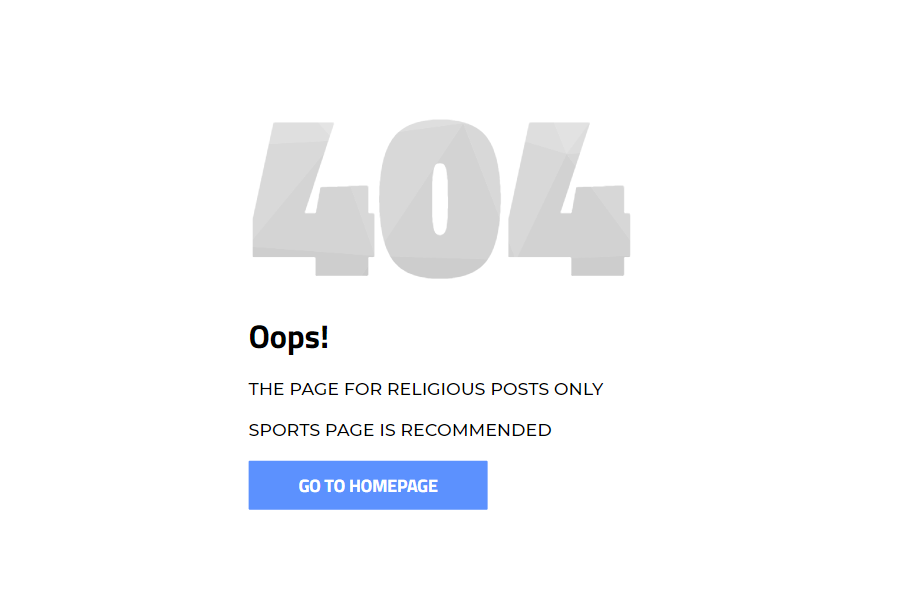

# Project Title

Social media Network
## Table of Contents

1. [OverView](#overview)
2. [Team Members](#Team_Members)
3. [Sign IN](#Sign_IN)
4. [Sign UP](#Sign_UP)
5. [Home Page](#Home_Page)
6. [Profile](#Profile_Page)	
7. [Edit Information](#Edit_Page)
8. [Post](#Post_Page)
9. [Error](#Error_Page)

## OverView

Our Project is a social Network based on AI so we can classify posts then choosing based on the topic which one will be published. 

### Sign_IN 

User who already signed up before can sgin in using UserName/Email and Password 

### Sign_UP 

User who visit our site for the first time can sign up by entering his information to data base. 

## Home_Page

User can Publish his Posts ,comment , like here . 

## Profile_Page

User also have a profile Page. 

## Edit_Page

User can edit his information/bio using this page. 

## Post_Page

User can see who commented in a post and who liked here 

## Error_Page

when classification of posts rejects a post of one kind this page pops .

## License

This project is licensed under the MIT License - see the [LICENSE.md](LICENSE.md) file for details

